import { Steps } from '@astrojs/starlight/components';

Пошаговая инструкция по настройке VPN на iOS.

## Установка клиента

Для подключения необходимо приобрести и установить приложение [Shadowrocket](https://apps.apple.com/cz/app/shadowrocket/id932747118) из App Store.

Мы не имеем отношения к разработке этого приложения и не получаем с него никакой выгоды. Мы выбрали именно его по одной простой причине: на сегодняшний день это единственное приложение, которое стабильно работает с необходимым плагином (v2ray), позволяющим обходить блокировки Роскомнадзора.

Ранее мы использовали Potatso, но его разработка остановлена. Другие альтернативы, к сожалению, либо больше не поддерживаются, либо работают нестабильно.

Если у вас возникнут сложности с покупкой или установкой, свяжитесь с нами — постараемся помочь.

## Подключение

### Через QR-код (cамый простой способ)

<Steps>

1. Скачиваем картинку с QR-кодом, полученную от поддержки Ctulhu VPN в галерею нашего устройства.

2. Открываем Shadowrocket, нажимаем "Добавить сервер".

    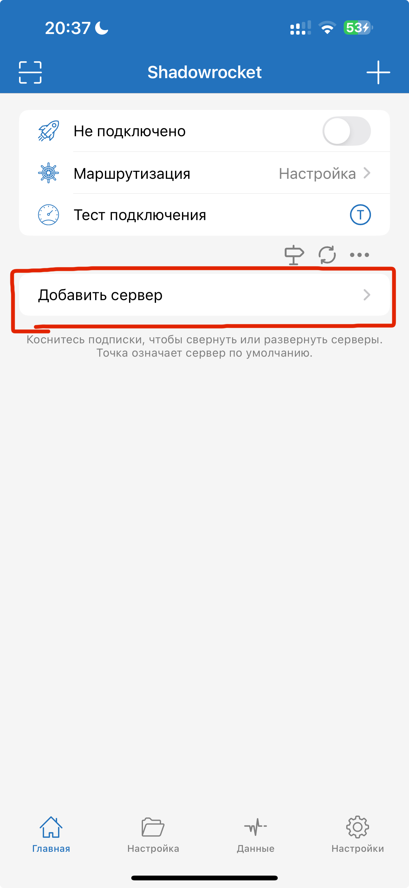

3. На экране с конфигурацией сервера, внизу нажимаем "Сканировать QR-код".

    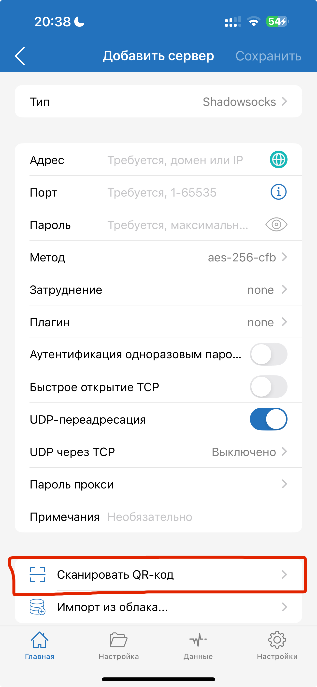

4. Когда откроется камера, нажимаем кнопку в правом верхнем углу, чтобы выбрать изображение с QR-кодом из галереи.

    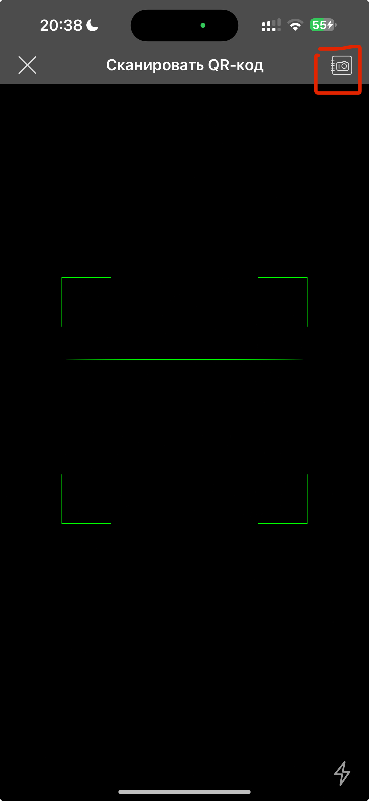

5. Выбираем скачанный QR-код, должно высветиться уведомление с сообщением "Успешно".

    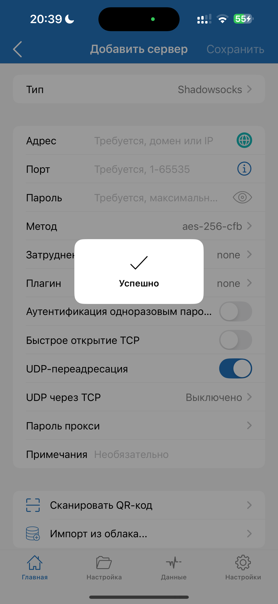

6. Возвращаемся на начальный экран с помощью стрелки в верхнем левом углу.

    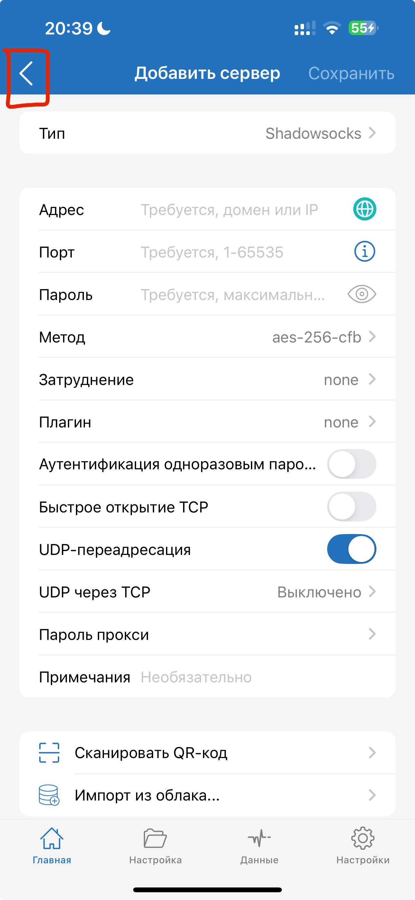

7. Переходим в меню выбора режима маршрутизации и выбираем режим "Прокси".

    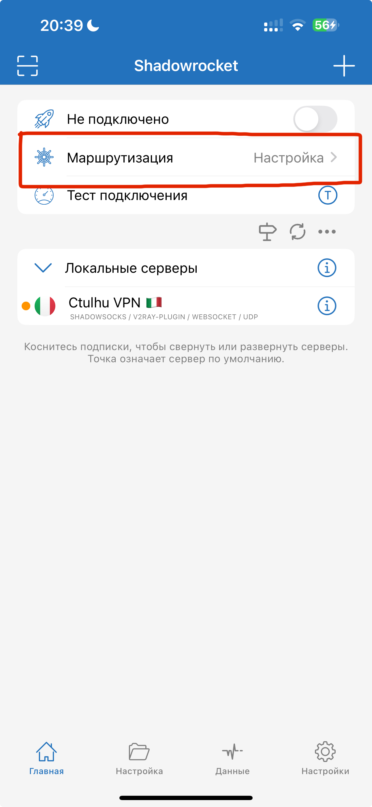
    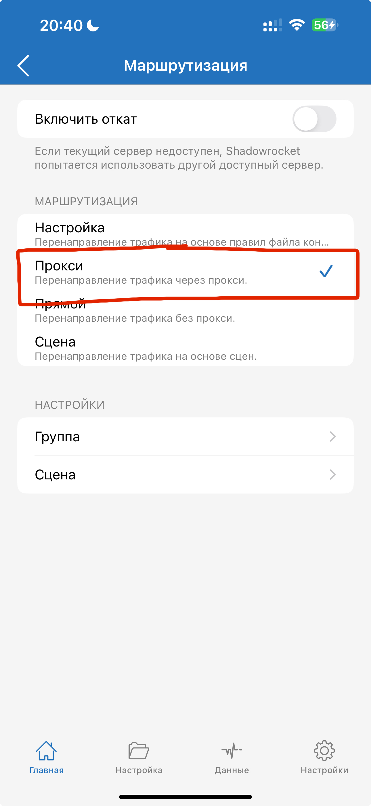

8. Подключаемся к ВПН при помощи переключателя в верхней части экрана, после чего высветится диалоговое окно с запросом установить профиль VPN. Нажимаем "Ок", после чего высветится еще одно диалоговое окно, где нужно разрешить установку профиля.

    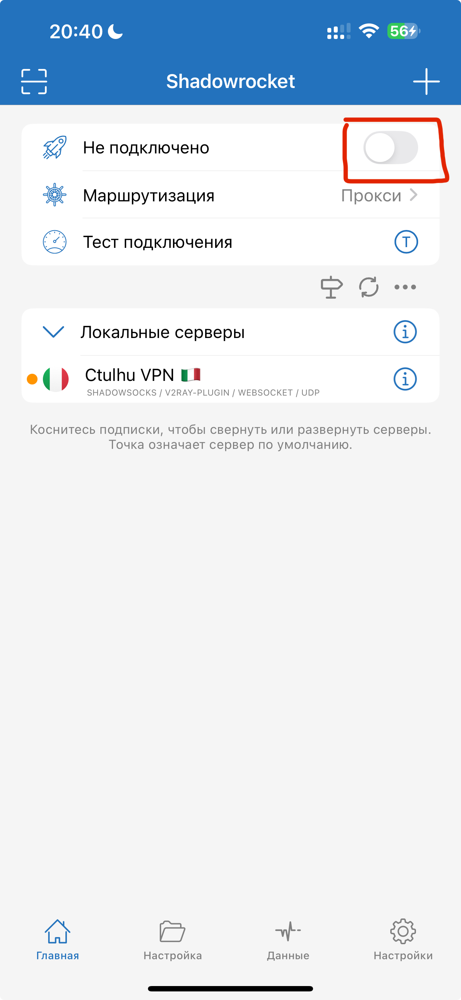
    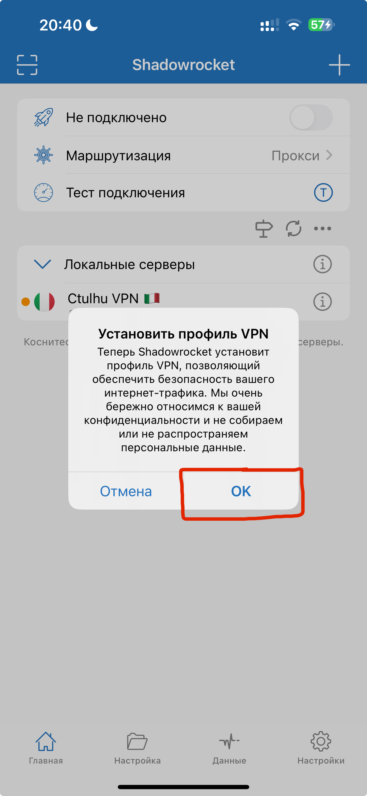
    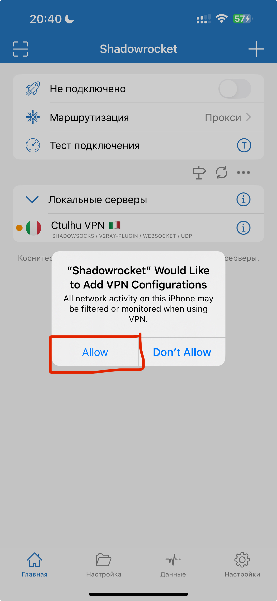

9. ВПН автоматически подключится, и в панели управления устройства появится значок VPN.

    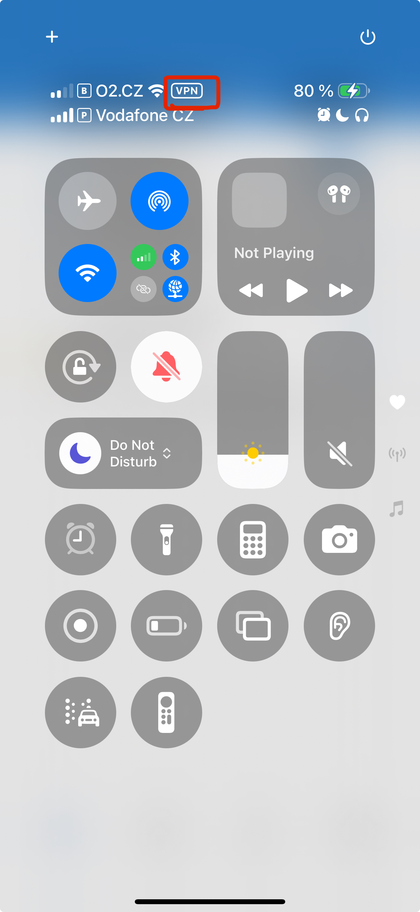

</Steps>